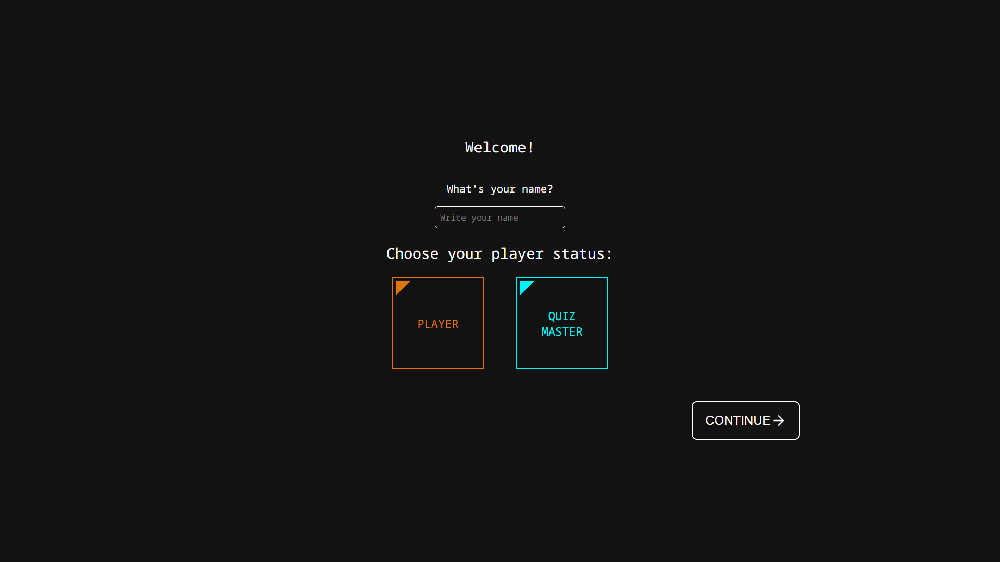

# Quiz app

## Introduction
This project is a **prototype** for the course "Expert Labs" in the bachelor of Multimedia & Creative Technologies at the Erasmushogeschool Brussel. It is not hosted.

This prototype is a small local quiz app, where 2 players compete against each other in a quiz where the quiz master has chosen the variables, such as number of questions, question category and difficulty.


## Setup & Installation
1. Clone this repository to get the latest version of this prototype.
2. Navigate to the './websockets-server' folder
```
cd ./websockets-server/
```
3. Install the npm packages
```
npm install
```
4. Start the socket server
```
nodemon index
```
5. In another terminal, navigate to the './quiz-app/quiz-app' folder
```
cd ./quiz-app/quiz-app/
```
6. Install the npm packages
```
npm install
```
7. Start the application
```
npm run start
```

The application will start in a new browser tab. In order to play, you'll need to duplicate it two times, so that the 2 players and the quiz master each have their screen.

## Features
* Choose your role on the homepage: player or quizmaster?
* As a quiz master, you can choose the category, the number of questions and the difficulty of the quiz. Once you're done, click on 'Create quiz' to get started!
* As a player, you have to wait on an opponent and on the questions to start. A waiting screen will inform you to have some patience.
* Once two players are present and the questions have been chosen, the game begins!
* Players have 30 seconds to answer each question, after which the game will move on to the next question. This is shown with a timer above the question.
* Already answered? Great! You'll have to wait until your opponent has answered, or until the 30 seconds run out.
* At the end of the game, all participants see an overview of the scores.

## Technical stack

Here's a brief overview of the technology stack this prototype uses:
* This prototype uses the [React](https://www.reactjs.org) framework.
* For the implementation of the multiplayer aspect, this prototype makes use of the [Socket.io](https://socket.io/) library. A socket client is made for each instance of the app, connecting to a socket server running locally.
* For the flow management of the game, [RxJS](https://rxjs.dev/) is used on the server side.
* The routing is implemented with the BrowserRouter from [React Router](https://reactrouter.com/en/main).
* Animations, like the timer animation, were made with [framer-motion](https://www.framer.com/motion/).
* All icons were imported from [React Feather](https://github.com/feathericons/feather).

## Author
This prototype has been created and is maintained by [Benoît Dossoine](https://github.com/BenoitDossoine).

