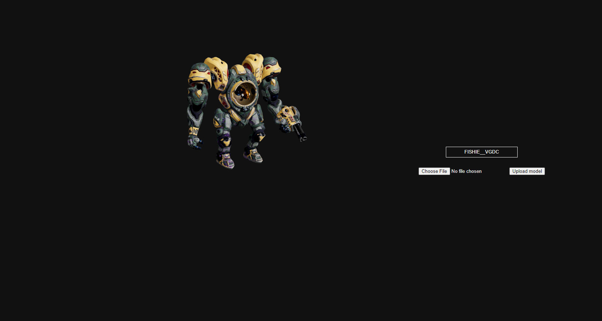

# 3D Model Loader

## Introduction

This project is a **prototype** made for the course "Expert Labs" in the bachelor of Multimedia & Creative Technologies at the Erasmushogeschool Brussel. It is not hosted.

This prototype is a loader for 3D models. Users can upload their own 3D models, which will appear in a list. When selected, the model is previewed in the application.
To prototype interactivity, a click event was added to the imported model, causing the clicked mesh to turn red when clicked.


## Use

1. Clone the 'three-js-prototype' branch of this repository to get the latest version of this prototype.

2. Navigate to the 'three-js-prototype/three-js-prototype' folder
```
cd ./three-js-prototype/three-js-prototype
```
3. Install the npm packages
```
npm install
```
4. Run the express server to allow local saving and fetching of files
```
nodemon server.js
```
5. Start the application
```
npm run start
```

The application will start in a new window.

## Features

* Upload your .glb 3D model to add it to the list of models.
* Contains a list of previously uploaded 3D models.
* Preview a 3D model by clicking on it in the list.
* No model selected yet? A placeholder text will be shown.

## Technical stack

Here's a brief overview of the technology stack this prototype uses:
* This prototype uses the [React](https://www.reactjs.org) framework.
* This prototype uses [Three.js](https://threejs.org/) and [React Three Fiber](https://docs.pmnd.rs/react-three-fiber/getting-started/introduction) for the 3D objects.
* Helper functions from [drei](https://github.com/pmndrs/drei) are used to show progress updates when a new model is loaded in.
* An express server is used as a local server, with [Axios](https://axios-http.com/docs/intro) handling the fetching of 3D models.
* [Multer](https://github.com/expressjs/multer) is a node.js middleware used for uploading new 3D models to a local storage.

## Author

This prototype has been created and is maintained by [Benoît Dossoine](benoit.dossoine.be).
