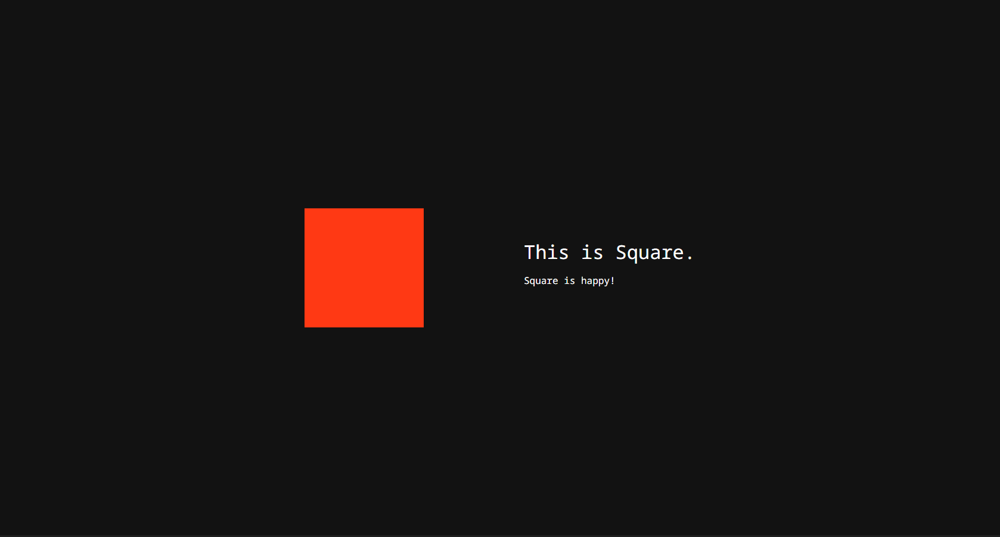

# The story of Square

## Introduction

This project is a **prototype** made for the course "Expert Labs" in the bachelor of Multimedia & Creative Technologies at the Erasmushogeschool Brussel. It is not hosted.

This prototype is an interactive story-telling website, about a square that likes to changes shapes and color.


## Use

1. Clone this repository to get the latest version of this prototype.

2. Navigate to the '/vue/first-vue-project' folder
```
cd ./vue/first-vue-project
```
3. Install the npm packages
```
npm install
```
4. Start the application
```
npm run dev
```

## Features

* Follow the story of Square, a shape that likes changing things about itself!
* You can hover over Square on the homepage to make him happy, or make him change colors or shape on the following pages!

## Technical stack

Here's a brief overview of the technology stack this prototype uses:
* This prototype uses the [Vue](https://vuejs.org) framework.
* To implement the animation, the [Anime.js](https://animejs.com/) animation libray was used.


## Sources

* [Programming Vue.js Fullpage Scroll](https://webdeasy.de/en/programming-vue-js-fullpage-scroll/#frameworks), Lorenz. Consulted on September 27th,2022.
## Author

This prototype has been created and is maintained by [Benoît Dossoine](benoit.dossoine.be).
